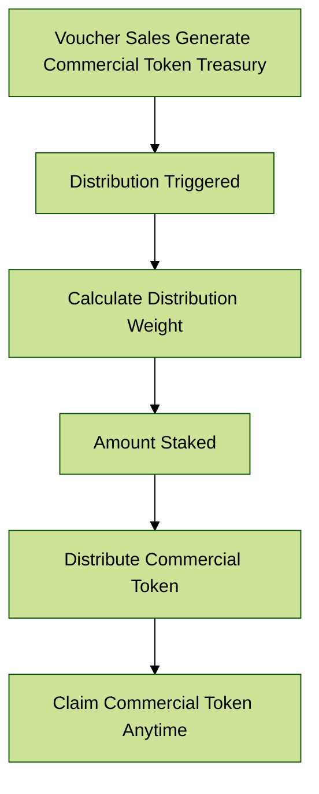

# 💎 Reward

The reward programs for DGYM and Commercial Tokens in DeGym are designed to incentivize and reward stakeholders based on their participation and commitment to the platform. The DGYM rewards are influenced by the amount staked and the duration of the stake, while the commercial  rewards (derived from the voucher sales) are only based on the amount staked.

## <mark style="color:green;">Rewarding DGYM</mark>

### Inflow

Inflows of DGYM are generated through [inflation](../../degym-dao/dgym-tokenomics/inflation.md).

### Distribution

Distributions are triggered at every period where DGYM is inflated. The distribution weight is calculated based on the amount staked and the locked time.

To address the concern of extremely long lock times distorting the reward distribution, we can modify the time weight calculation using a logarithmic function. This approach ensures that the weight increases with time but at a diminishing rate, preventing excessively long lock durations from overwhelming the distribution.

#### Bond Weight Calculation

We will use the following formula to calculate the weight for **each bond**:

$$
w_i​=a_i​×log(\Delta T_i ​+ 1)
$$

Where:

* $$a_i$$ is the DGYM amount locked by **bond** $$i$$.
* $$\Delta T_i$$ is the remaining time locked by **bond** $$i$$ (in days).
* $$w_i$$ is the amount locked by **bond** $$i$$.

#### Total Weight Calculation

The total weight for all staking bonds remains the same:

$$
W=  \sum_{j=1}^{n}​w_j
$$

#### Distributed Reward

The reward for **each bond** can be calculated as follows:

$$
r_i​=\frac{w_i}{W}​​×R
$$

Where:

* $$R$$ is the total reward (generated from inflation).

### Outflow

After distribution, stakeholders can claim their DGYM rewards from all bonds not set as auto compound.

## <mark style="color:green;">Rewarding Commercial Token</mark>

### Inflow

Inflows of the commercial token are generated through voucher sales.

### Distribution

Distributions are triggered at every voucher renewal. The distribution weight is calculated based on the amount staked.

### Outflow

After distribution, stakeholders can claim the commercial token at any moment.

## Key Features

* **Inflation Mechanism**: The reward distribution is more favorable in the early stages and gradually decreases over time.
* **Stake Amount and Duration**: Both the amount staked and the duration of the lock influence the reward distribution.
* **Commercial Token Rewards**: Users are rewarded in Commercial Token based on voucher purchases, distributed according to the stake amount.

## Detailed Steps

1. **Stake DGYM**: Users stake their DGYM tokens.
2. **Set Lock Duration**: Users set the duration for which their DGYM will be locked.
3. **Calculate DGYM Reward**: The reward in DGYM is calculated based on the stake amount and lock duration.
4. **Distribute DGYM Reward**: The calculated DGYM reward is distributed to the stakeholders.
5. **Calculate Commercial Token Reward**: The reward in Commercial Token is calculated based on the stake amount.
6. **Distribute Commercial Token Reward**: The calculated Commercial Token reward is distributed to the user.
