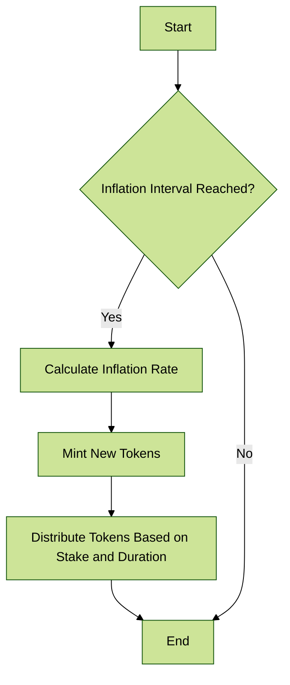

# ♻️ Inflation

## <mark style="color:green;">DGYM Token Inflation Mechanism</mark>

The DGYM Token employs an inflation mechanism **designed to regulate the token supply dynamically**. This document explains how the inflation mechanism works and provides details about the smart contract's behavior.

### Parameters

* **Inflation Decay Constant**: 0.046% (Approx 17% annual decay)
* **Max Supply**: 10,000,000,000 DGYM
* **Initial Supply**: 1,000,000,000 DGYM
* **Inflation Interval**: Daily


These parameters can be modified through the DAO voting&#x20;


### Inflation Rate Calculation

The daily inflation rate is dynamically calculated based on the remaining supply ratio and a decay constant. The formula used is:

$$
Y_c = D_c \times \left( \frac{S_m - S_c}{S_m} \right)
$$

Where:

* $$D_c$$ is the inflation decay constant (daily).
* $$S_m$$ is the maximum supply.
* $$S_c$$ is the current supply.

### Inflation Application

The inflation is applied daily. When the inflation is applied, new tokens are minted and added to the total supply. **The total supply asymptotically approaches the the max supply**.

<figure><figcaption></figcaption></figure>

### Staking and Distribution

Stakeholders can stake their DGYM tokens to earn rewards. The reward distribution is based on the amount staked and the duration for which the tokens are staked. The longer the tokens are staked, the higher the reward.

***

The DGYM Token's inflation mechanism ensures that the token supply is dynamically regulated while rewarding stakeholders based on their contribution and commitment. The smart contract implementation ensures fairness and transparency in the distribution of rewards.
