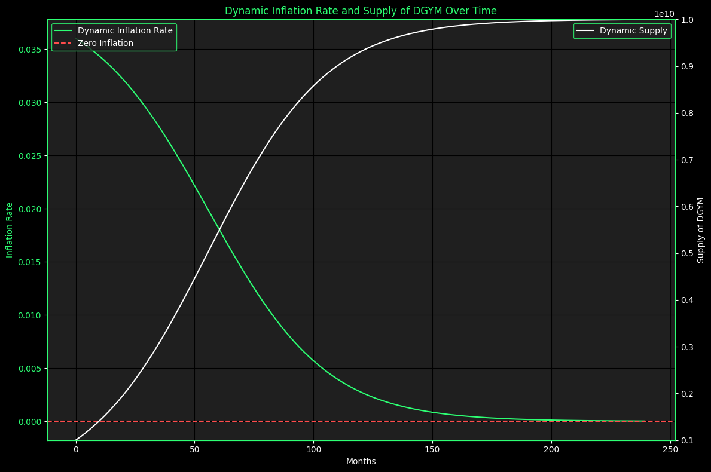

# ♻️ Inflation

## DGYM Token Inflation Mechanism

The DGYM Token employs an inflation mechanism **designed to regulate the token supply dynamically**. This document explains how the inflation mechanism works and provides details about the smart contract's behavior.

### Parameters

* **Decay Constant**: 0.004
* **Max Supply**: 10,000,000,000 DGYM
* **Initial Supply**: 1,000,000,000 DGYM
* **Inflation Interval**: Monthly

### Inflation Rate Calculation

The inflation rate is dynamically calculated based on the remaining supply ratio and a decay constant. The formula used is:

$$
\text{inflation_rate} = \text{decay_constant} \times \left( \frac{\text{max_supply} - \text{current_supply}}{\text{max_supply}} \right)
$$

Where:

* `decay_constant` is 0.04.
* `current_supply` is the total supply of DGYM at the time of calculation.
* `max_supply` is 10,000,000,000 DGYM.

### Inflation Application

The inflation is applied monthly. When the inflation is applied, new tokens are minted and added to the total supply. **The total supply never exceeds the max supply of 10,000,000,000 DGYM**.

### Staking and Distribution

Stakeholders can stake their DGYM tokens to earn rewards. The reward distribution is based on the amount staked and the duration for which the tokens are staked. The longer the tokens are staked, the higher the reward.

<figure><figcaption></figcaption></figure>

## Conclusion

The DGYM Token's inflation mechanism ensures that the token supply is dynamically regulated while rewarding stakeholders based on their contribution and commitment. The smart contract implementation ensures fairness and transparency in the distribution of rewards.
