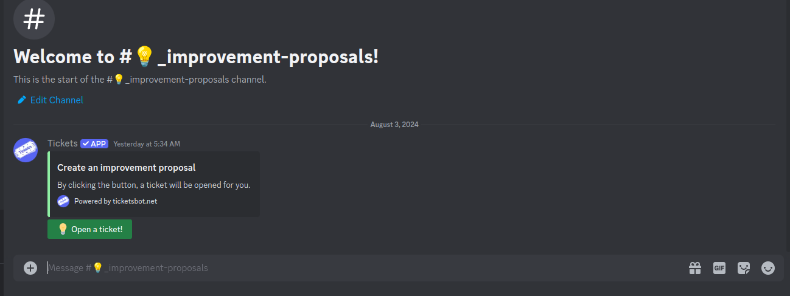

# Proposal

## <mark style="color:green;">DGIP - DeGym Improvement Proposals</mark> <a href="#template" id="template"></a>

Before any proposal goes for voting we create improvement proposals which will be stored on the following repository:



You can also submit your proposal on our [community discord](https://discord.gg/FtTcGh4q) through the \`#💡\_improvement-proposals \`.

<figure><figcaption></figcaption></figure>

## <mark style="color:green;">**Who can create proposals?**</mark> <a href="#template" id="template"></a>

Anyone having at least `500,000 $DGYM` tokens may make proposals, but for a proposal to be heard by the council, it needs to reach at least a minimum percentage (to be determined at network launch) of the entire DeGym token supply.

All proposals must adhere to the guidelines outlined in this section of the official DeGym Documentation, the latest published template, and must contain direct & objective descriptions. All other proposals will be deleted for housekeeping purposes.

## <mark style="color:green;">Template</mark>

```markdown
# Proposal: [Title of Your Proposal]

## Summary

Provide a brief overview of what your proposal aims to achieve. Clearly state the problem you are addressing or the feature you propose implementing.

## Motivation

Explain the reason behind this proposal. Describe why this change or feature is essential for the DeGym ecosystem. Highlight any potential benefits or improvements it would bring.

## Proposal Details

Go into the details of your proposal:

### Goals

Outline the specific goals of your proposal. What do you intend to achieve by implementing this change or feature?

### Implementation

Describe the technical details of how you plan to implement this proposal. Include any relevant code changes, architecture considerations, and dependencies. Provide a step-by-step explanation if applicable.

### User Experience

Explain how DeGym DAO members and DeGym Protocol users will interact with this proposal. How will it impact their experience? If it's a user-facing feature, consider providing visual mock implementation.
```
