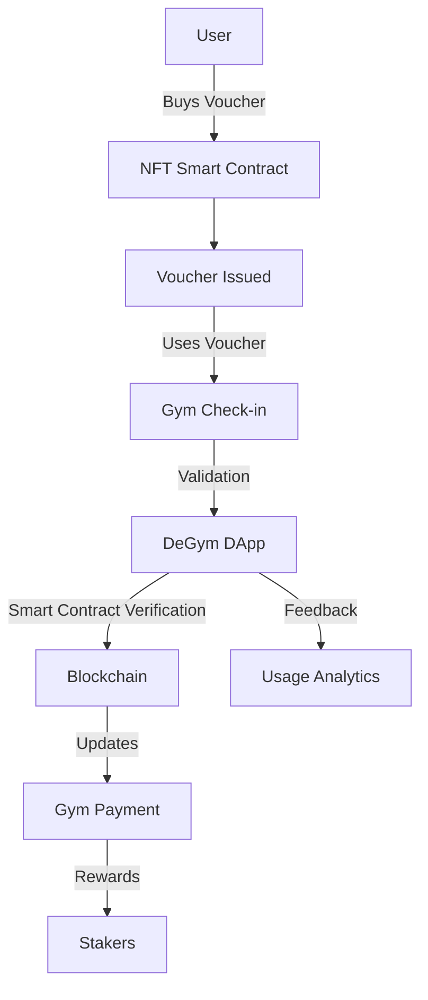
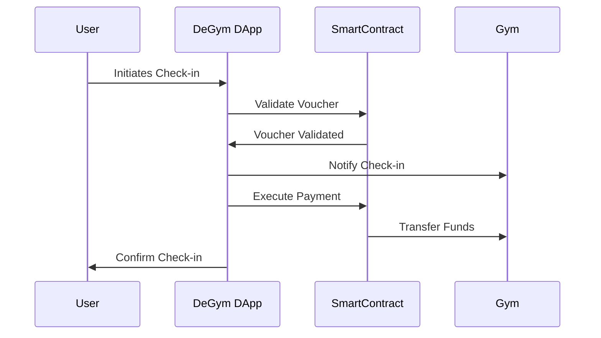
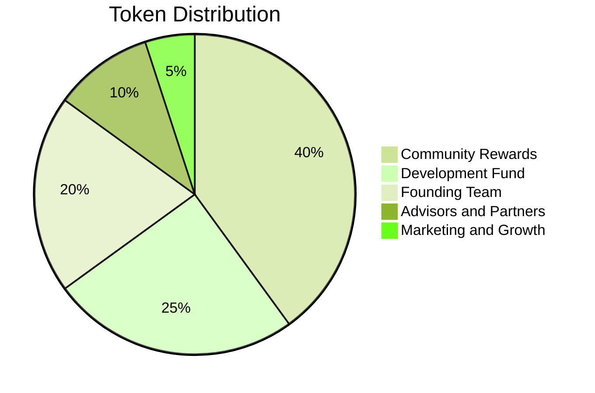

### Technical Architecture

&#x20;

```mermaid
%%{init: {'theme': ''}}%%
graph TD
    A[User] -->|Buys Voucher| B[NFT Smart Contract]
    B --> C[Voucher Issued]
    C -->|Uses Voucher| D[Gym Check-in]
    D -->|Validation| E[DeGym DApp]
    E -->|Smart Contract Verification| F[Blockchain]
    F -->|Updates| G[Gym Payment]
    G -->|Rewards| H[Stakers]
    E -->|Feedback| I[Usage Analytics]
```

### Check-in Process

&#x20;

```mermaid
%%{init: {'theme': ''}}%%
sequenceDiagram
    participant User
    participant DeGym DApp
    participant SmartContract
    participant Gym
    User ->> DeGym DApp: Initiates Check-in
    DeGym DApp ->> SmartContract: Validate Voucher
    SmartContract ->> DeGym DApp: Voucher Validated
    DeGym DApp ->> Gym: Notify Check-in
    DeGym DApp ->> SmartContract: Execute Payment
    SmartContract ->> Gym: Transfer Funds
    DeGym DApp ->> User: Confirm Check-in

```

### Token Distribution

&#x20;

```mermaid
%%{init: {'theme': 'forest'}}%%
pie
    title Token Distribution
    "Community Rewards": 40
    "Development Fund": 25
    "Founding Team": 20
    "Advisors and Partners": 10
    "Marketing and Growth": 5

```