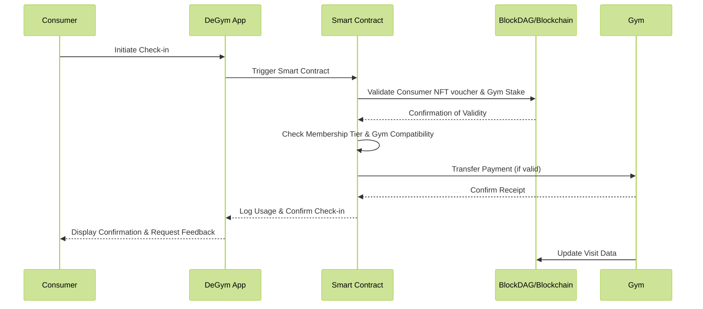

# Check-in Process

#### Detailed Check-in Process Using Smart Contracts for DeGym DAO

The check-in process in DeGym DAO leverages a robust smart contract system designed to handle interactions securely and efficiently:

1. **Consumer Check-in Initiation**:
   * **Action**: The consumer arrives at the gym and opens the DeGym app.
   * **Process**: The consumer selects the check-in option which triggers the app to interact with the smart contract on the blockchain.
2. **Smart Contract Activation**:
   * **Validation**: The smart contract first verifies the authenticity and validity of the consumer's NFT voucher for the current day.
   * **Simultaneous Validation**: The gym’s commitment is verified by checking the staked amount in the blockchain to ensure the gym's eligibility to receive payments.
3. **Conditions Verification**:
   * **Membership Tier**: Checks if the consumer's voucher tier corresponds to the gym's accepted tiers.
   * **Gym Compatibility**: Ensures that the gym is part of the network and ready to accept check-ins from the consumer’s voucher tier.
4. **Transaction and Check-in Execution**:
   * **Payment Transaction**: If all conditions are met, the smart contract facilitates the transfer of funds from the consumer's wallet to the gym's account.
   * **Usage Log**: The smart contract records the use of the voucher for that day, decrementing the available days or sessions from the NFT.
5. **Confirmation and Receipt**:
   * **To Consumer**: The consumer receives a digital receipt and confirmation on their app that the check-in was successful and payment has been made.
   * **To Gym**: The gym receives confirmation that the funds have been transferred to their account and the consumer’s entry is authorized.
6. **Error Handling**:
   * **Insufficient Funds**: If the consumer’s wallet has insufficient funds, the transaction is aborted, and an error is reported.
   * **Invalid Membership**: If the NFT is not valid for the day or tier, the check-in is denied.
7. **Post-Check-in Actions**:
   * **Feedback Request**: The consumer is prompted to rate their experience, providing valuable feedback to the gym.
   * **Usage Analytics**: The gym receives data about the frequency of visits, which helps in planning and resource allocation.

&#x20;

