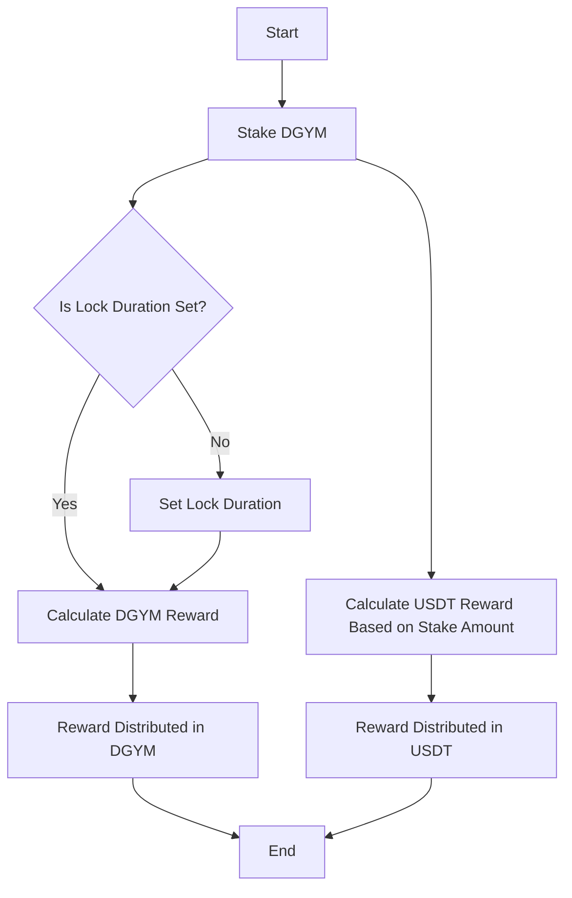
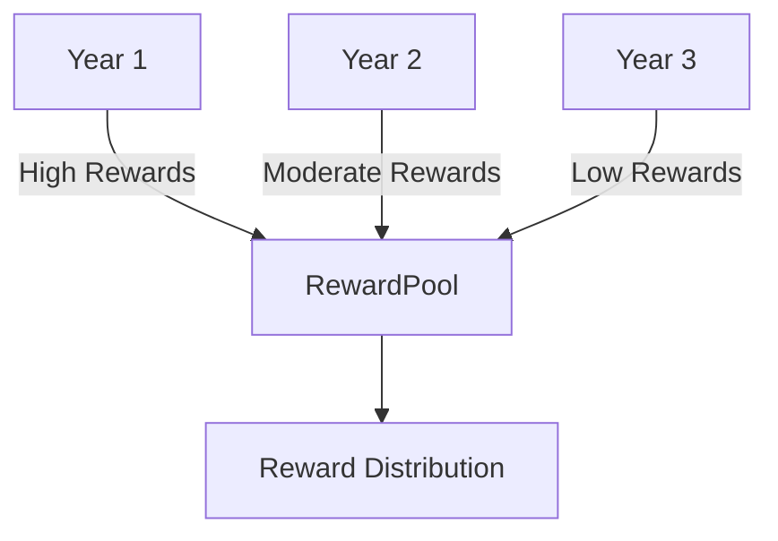

# Reward Program

The DeGym reward program is designed to incentivize early participation and long-term commitment. This program provides rewards in both DGYM and USDT based on staking activities.

For **DGYM reward** the total rewards are distributed based on the stake amount and lock duration of each user's stakeholder.
For **USDT reward** the total rewards are distributed based on the stake amount of each stakeholder.

## Key Features

- **Inflation Mechanism**: The reward distribution is more favorable in the early stages and gradually decreases over time. 
The inflation rate starts at 50% and decays logarithmically over 20 years, reaching an asymptote at 1%.

- **Stake Amount and Duration**: Both the amount staked and the duration of the lock influence the reward distribution.
- **USDT Rewards**: Users are rewarded in USDT based on voucher purchases, distributed according to the stake amount.

## Reward Distribution

### DGYM Rewards

The DGYM rewards are distributed based on two factors:
1. **Stake Amount**: The more DGYM staked, the higher the reward.
2. **Lock Duration**: The longer the DGYM is locked, the greater the reward.

### USDT Rewards

USDT rewards are distributed based on the stake amount. The distribution mechanism does not consider the lock duration for USDT rewards.

## Reward Program Flow

## Detailed Steps

1. **Stake DGYM**: Users stake their DGYM tokens.
2. **Set Lock Duration**: Users set the duration for which their DGYM will be locked.
3. **Calculate DGYM Reward**: The reward in DGYM is calculated based on the stake amount and lock duration.
4. **Distribute DGYM Reward**: The calculated DGYM reward is distributed to the user.
5. **Calculate USDT Reward**: The reward in USDT is calculated based on the stake amount.
6. **Distribute USDT Reward**: The calculated USDT reward is distributed to the user.

## Inflation Mechanism

The inflation mechanism ensures that the rewards are higher for early adopters and decrease over time.

## Suggestions for Improvement

* **Visual Examples**: Add visual examples or case studies showing different scenarios of staking and rewards.
* **FAQ Section**: Include a FAQ section addressing common questions about the reward program.
* **Interactive Calculator**: Provide an interactive calculator tool on the DeGym platform to help users estimate their potential rewards based on different staking amounts and durations.