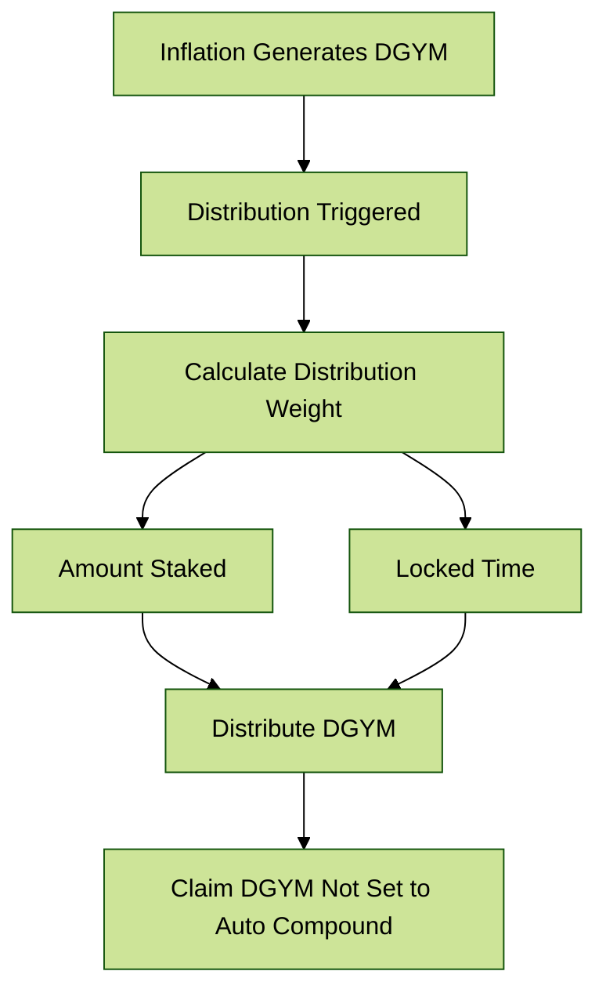
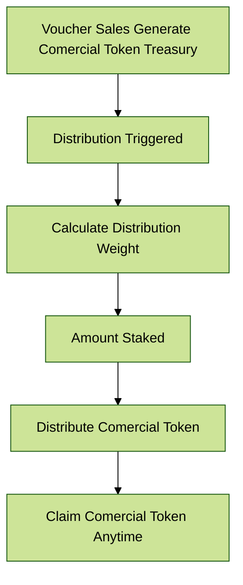

# 💎 Reward

The reward programs for DGYM and Comercial Tokens in DeGym are designed to incentivize and reward stakeholders based on their participation and commitment to the platform. The DGYM rewards are influenced by the amount staked and the duration of the stake, while the comercial  rewards (derived from the voucher sellings) are only based on the amount staked.

## Rewarding DGYM

### Inflow

Inflows of DGYM are generated through [inflation](degym-tokenomics/inflation.md).

### Distribution

Distributions are triggered at every period where DGYM is inflated. The distribution weight is calculated based on the amount staked and the locked time.

To address the concern of extremely long lock times distorting the reward distribution, we can modify the time weight calculation using a logarithmic function. This approach ensures that the weight increases with time but at a diminishing rate, preventing excessively long lock durations from overwhelming the distribution.

#### Weight Calculation

We will use the following formula to calculate the weight for each user:

$$
Weight_i​=A_i​×log(remainingTime_i ​+ 1)
$$

Where:

* $$A_i$$ is the amount locked by user $$ii$$.
* $$remainingTime_i$$ is the time locked by user $$ii$$ (in days).

#### Total Weight Calculation

The total weight for all users remains the same:

$$
TotalWeight=  \sum_{j=1}^{n}​(A_j​×log(remainingTime_j​+1))
$$

#### Distributed Reward

The reward for each user can be calculated as follows:

$$
Reward_i​=(Weight_i \div TotalWeight​​)×R
$$

Where:

* $$R$$ is the total reward pool.

After distribution, stakeholders can claim the DGYM amount that is not set to auto compound.

## Rewarding Comercial Token

### Inflow

Inflows of the comercial token are generated through voucher sales.

### Distribution

Distributions are triggered at every voucher renewal. The distribution weight is calculated based on the amount staked.

### Outflow

After distribution, stakeholders can claim the comercial token at any moment.

## Key Features

* **Inflation Mechanism**: The reward distribution is more favorable in the early stages and gradually decreases over time.
* **Stake Amount and Duration**: Both the amount staked and the duration of the lock influence the reward distribution.
* **Comercial Token Rewards**: Users are rewarded in Comercial Token based on voucher purchases, distributed according to the stake amount.

## Detailed Steps

1. **Stake DGYM**: Users stake their DGYM tokens.
2. **Set Lock Duration**: Users set the duration for which their DGYM will be locked.
3. **Calculate DGYM Reward**: The reward in DGYM is calculated based on the stake amount and lock duration.
4. **Distribute DGYM Reward**: The calculated DGYM reward is distributed to the stakeholders.
5. **Calculate Comercial Token Reward**: The reward in Comercial Token is calculated based on the stake amount.
6. **Distribute Comercial Token Reward**: The calculated Comercial Token reward is distributed to the user.
