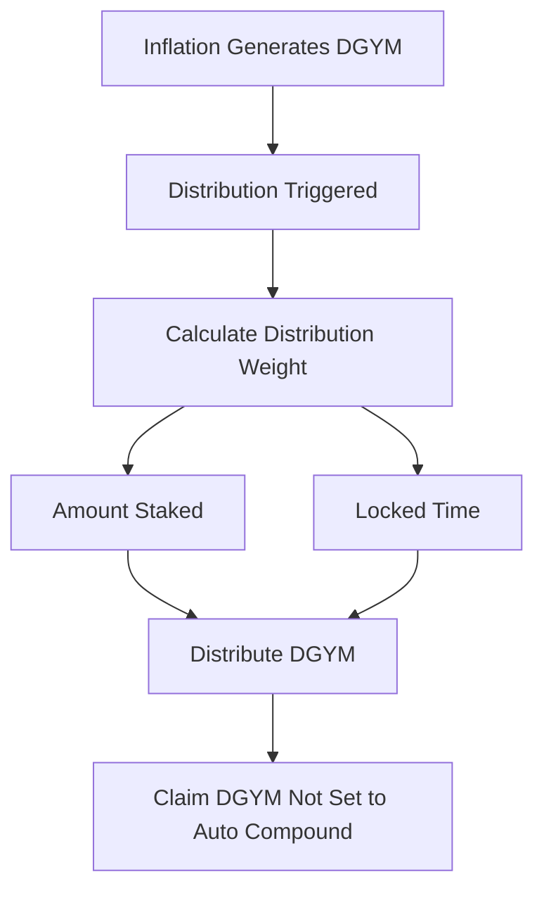
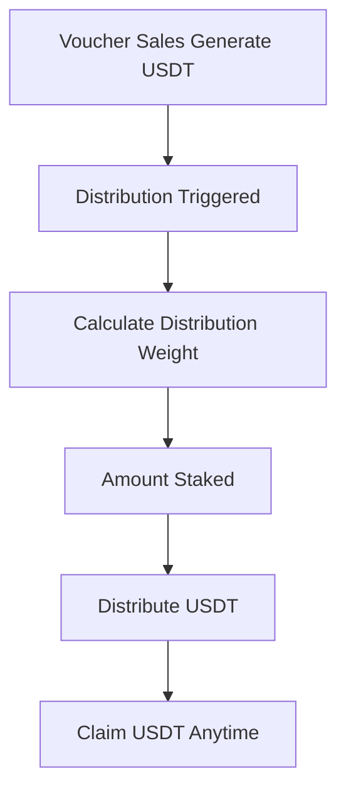

# DeGym Reward Program

The reward programs for DGYM and USDT in DeGym are designed to incentivize and reward stakeholders based on their participation and commitment to the platform. The DGYM rewards are influenced by the amount staked and the duration of the stake, while the USDT rewards are based on the amount staked.

## Rewarding DGYM

### Inflow
Inflows of DGYM are generated through inflation.

### Distribution
Distributions are triggered at every period where DGYM is inflated. The distribution weight is calculated based on the amount staked and the locked time.

### Outflow
After distribution, stakeholders can claim the DGYM amount that is not set to auto compound.

## Rewarding USDT

### Inflow
Inflows of USDT are generated through voucher sales.

### Distribution
Distributions are triggered at every voucher renewal. The distribution weight is calculated based on the amount staked.

### Outflow
After distribution, users can claim the USDT at any moment.

## Key Features

- **Inflation Mechanism**: The reward distribution is more favorable in the early stages and gradually decreases over time. 
- **Stake Amount and Duration**: Both the amount staked and the duration of the lock influence the reward distribution.
- **USDT Rewards**: Users are rewarded in USDT based on voucher purchases, distributed according to the stake amount.

## Detailed Steps

1. **Stake DGYM**: Users stake their DGYM tokens.
2. **Set Lock Duration**: Users set the duration for which their DGYM will be locked.
3. **Calculate DGYM Reward**: The reward in DGYM is calculated based on the stake amount and lock duration.
4. **Distribute DGYM Reward**: The calculated DGYM reward is distributed to the user.
5. **Calculate USDT Reward**: The reward in USDT is calculated based on the stake amount.
6. **Distribute USDT Reward**: The calculated USDT reward is distributed to the user.

## Inflation Mechanism

The inflation mechanism ensures that the rewards are higher for early adopters and decrease over time.
