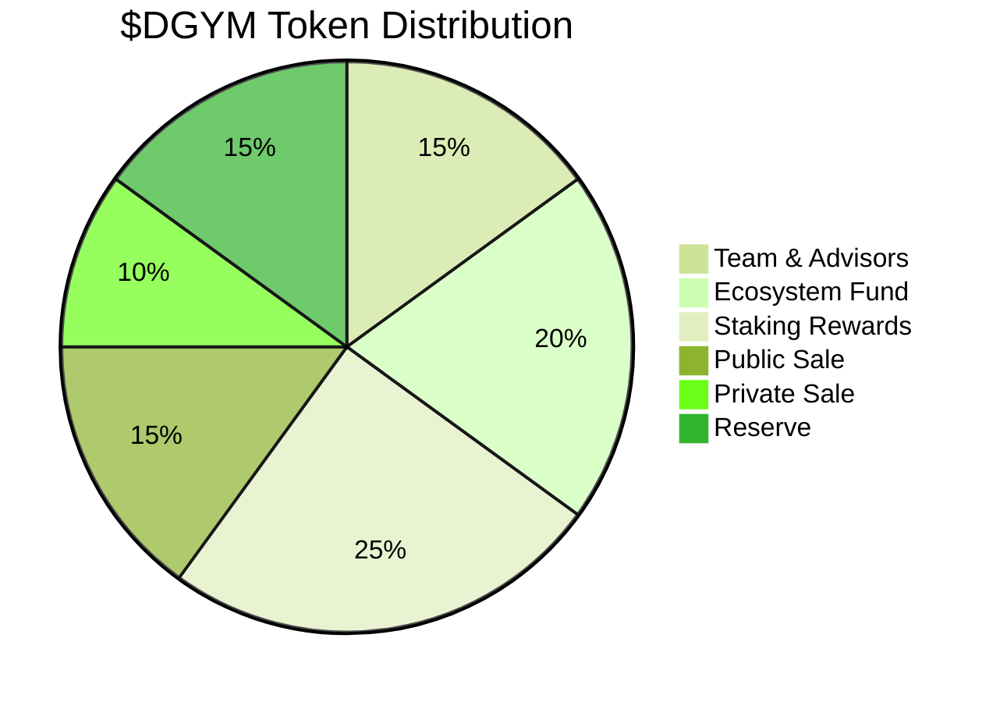

# $DGYM Tokenomics

### Token Info

Token Ticker: $DGYM

Total Supply: {XXX}M

Token Contract Standard: ERC20

Token Contract Address: 0x...

### Distribution

Initial Distribution Plan:

&#x20;

### Allocation

| Allocation         | Percentage of Total Supply | Explanation                                         |
|--------------------|----------------------------|-----------------------------------------------------|
| Team & Advisors    | 15%                        | Tokens allocated to the team and advisors for their ongoing contributions and support. |
| Ecosystem Fund     | 20%                        | Reserved for fostering the ecosystem, funding partnerships, and community incentives. |
| Staking Rewards    | 25%                        | Distributed to consumers who stake their tokens as part of the network's security and operation incentives. |
| Public Sale        | 15%                        | Tokens sold to the general public to raise funds and increase token circulation. |
| Private Sale       | 10%                        | Tokens sold through private offerings before public sale to strategic investors. |
| Reserve            | 15%                        | Held to ensure liquidity, future financing, and operational flexibility. |

### Utility

The $DGYM token serves multiple utility functions within the DeGym DAO ecosystem, enhancing its intrinsic value and usability:
  - **Access and Voucher:** Tokens can be used to purchase NFT-based gym voucher, providing access to a network of gyms.
  - **Staking Rewards:** Token holders can stake their $DGYM to earn rewards, which incentivizes security and participation in the network.
  - **Governance:** $DGYM holders have voting rights in the DAO, allowing them to participate in decision-making processes regarding the development and rules of the ecosystem.
  - **Payment and Incentives:** Gyms receive $DGYM tokens as payment for check-ins, and users may receive tokens as rewards for fitness-related activities and promotions.

These utilities ensure that $DGYM remains a vital and active component of the DeGym ecosystem, facilitating both operational needs and strategic growth.

