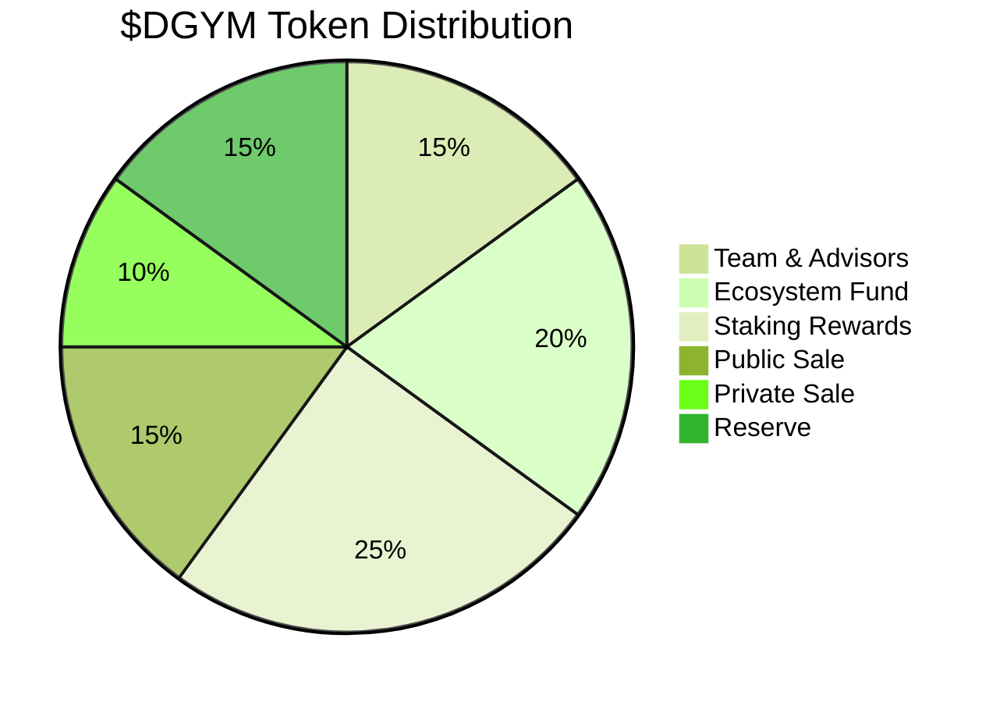
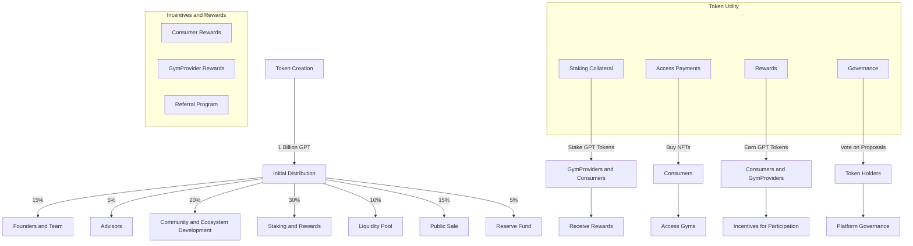

# $DGYM Tokenomics

### Token Info

Token Ticker: $DGYM

Total Supply: {XXX}M

Token Contract Standard: ERC20

Token Contract Address: 0x...

### Distribution

Initial Distribution Plan:

&#x20;

### Allocation

| Allocation         | Percentage of Total Supply | Explanation                                         |
|--------------------|----------------------------|-----------------------------------------------------|
| Team & Advisors    | 15%                        | Tokens allocated to the team and advisors for their ongoing contributions and support. |
| Ecosystem Fund     | 20%                        | Reserved for fostering the ecosystem, funding partnerships, and community incentives. |
| Staking Rewards    | 25%                        | Distributed to consumers who stake their tokens as part of the network's security and operation incentives. |
| Public Sale        | 15%                        | Tokens sold to the general public to raise funds and increase token circulation. |
| Private Sale       | 10%                        | Tokens sold through private offerings before public sale to strategic investors. |
| Reserve            | 15%                        | Held to ensure liquidity, future financing, and operational flexibility. |

### Token Utility

1. Staking Collateral:
   * GymProviders must stake DGYM tokens as collateral to ensure their credibility.
   * Consumers can stake DGYM tokens to gain premium access to gyms.
2. Access Payments:
   * Consumers can purchase NFTs membership access using DGYM tokens.
3. Rewards:
   * Consumers and GymProviders earn DGYM tokens as rewards for participation and maintaining system integrity.
4. Incentives and Rewards:
   * For Consumers:
     1. Staking Rewards:
     2. Consumers who stake DGYM tokens for premium access receive additional tokens as rewards.
     3. Example: 5% annual staking reward.
     4. Usage Rewards:
     5. Consumers receive DGYM tokens for regular use of the platform (booking sessions, attending gyms).
   * For Gym Providers:
     1. Staking Rewards:
        * GymProviders who stake tokens receive additional DGYM tokens as rewards.
        * Example: 5% annual staking reward.
     2. Activity Rewards:
        * Rewards for high activity and positive consumer feedback.
   * Referral Program:
     * Consumers and GymProviders can earn GPT tokens by referring new participants to the platform.
5. Governance
   * Proposals and Voting:
     * Token holders can submit proposals for changes or new features.
     * Voting power is proportional to the number of tokens held.
   * Community Involvement:
     * Regular community meetings to discuss proposals and gather feedback.

