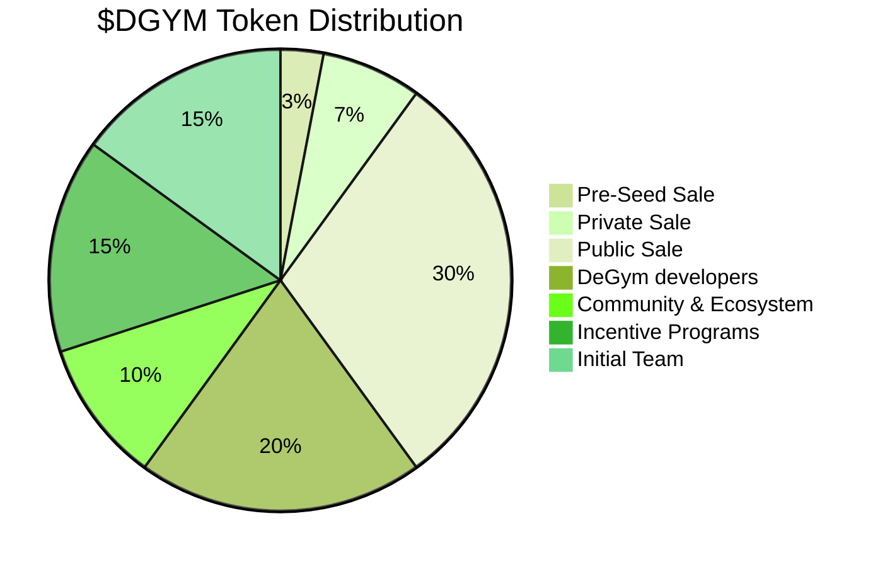

# 💰 $DGYM Tokenomics

Note: this is a _**preliminary outline**_ of the overall intent for the DeGym DAO's economics. These designs will be finalized at dapp launch via the governance process by stakeholders from the community, and they are subject to alterations via the same process.

DeGym token would also provide the economic incentives which will be distributed to encourage users to contribute and maintain the ecosystem on DeGym, thereby creating a win-win system where every participant is fairly compensated for its efforts. DeGym token is an integral and indispensable part of DeGym, because without DeGym token, there would be no incentive for users to expend resources to participate in activities or provide services for the benefit of the entire ecosystem on DeGym. Given that additional DeGym token will be awarded to a user based only on its actu~~a~~l usage, activity and contribution on DeGym, users of DeGym and/or holders of DeGym token which did not actively participate will not receive any DeGym token incentives.

### Token Info

Token Ticker: $DGYM

Initial Supply: 1 Billion.

Max Supply: 10 Billion.

Token Contract Standard: ERC20

Token Contract Address: 0x... (coming soon)

There will be inflation (see the section on [Rewards](../technical/inflation.md)) which comes in the form of block rewards providing staking yield, but will only inflate upon stakes that are in circulation and have been delegated to consensus nodes. In other words, any tokens that are locked cannot be staked or delegated, therefore generates no inflation.

### Distribution

Initial Distribution Plan:

### Allocation

<table><thead><tr><th width="154">Allocation</th><th width="128">% of Initial Total Supply</th><th>Explanation</th></tr></thead><tbody><tr><td>Pre-Seed Sale</td><td>3%</td><td>We aim to make the protocol lauch, as well as the DAO more populated by providing a pre-seed buy opportunity. <strong>A special pre-seed contract will hold $DGYM that people can buy from TGE until the end of the pre-seed period. All remaining supply will be burnt at the end of presale.</strong></td></tr><tr><td>Private Sale</td><td>7%</td><td>Tokens sold through private offerings before public sale to strategic investors. <strong>3 month cliff, 24 month-long even vesting period.</strong></td></tr><tr><td>Public Sale</td><td>30%</td><td>Tokens sold to the general public to raise funds and increase token circulation.</td></tr><tr><td>DeGym developers</td><td>20%</td><td>Will be used to cover development expenses after launch. <strong>Expense subject to governance vote.</strong></td></tr><tr><td>Community &#x26; Ecosystem</td><td>10%</td><td>Reserved for fostering the ecosystem, funding partnerships, and community incentives.</td></tr><tr><td>Incentive Programs</td><td>15%</td><td>Held to ensure liquidity, future financing, and operational flexibility.</td></tr><tr><td>Initial Team</td><td>15%</td><td><strong>5% unlocked instantly</strong> to core members, even distribution. For the <strong>remaining 10%: 3 month cliff, 12 month-long even vesting period.</strong></td></tr></tbody></table>

### Utility

The $DGYM token serves multiple utility functions within the DeGym DAO ecosystem, enhancing its intrinsic value and usability:

* **Access and Voucher:** Tokens can be used to purchase NFT-based gym voucher, providing access to a network of gyms.
* **Staking Rewards:** Token holders can stake their $DGYM to earn rewards, which incentivizes security and participation in the network.
* **Governance:** $DGYM holders have voting rights in the DAO, allowing them to participate in decision-making processes regarding the development and rules of the ecosystem.
* **Payment and Incentives:** Gyms receive $DGYM tokens as payment for check-ins, and users may receive tokens as rewards for fitness-related activities and promotions.

These utilities ensure that $DGYM remains a vital and active component of the DeGym ecosystem, facilitating both operational needs and strategic growth.

***

**No Slashing**

DeGym will not implement a slashing or punishment mechanisms at this moment.

It is incredibly difficult to design economic incentive schemes that properly motivate players in a system to behave in ways that are deemed constructive. As a rule, such mechanisms need to be as simple as possible, as more complexity creates more opportunities to game these mechanisms.
