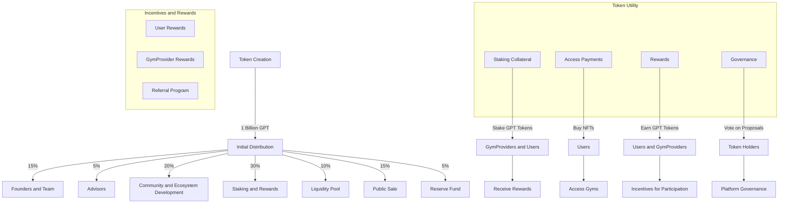

# $DGYM Tokenomics

### Token Info

Token Ticker: $DGYM

Total Supply: {XXX}M

Token Contract Standard: ERC20

Token Contract Address: 0x...

### Token Distribution

Initial Distribution Plan:

* Founders And Team: 15%
  * Vesting period: 4 years with a 1-year cliff.
* Advisors: 5%
  * Vesting period: 2 years
* Community and Ecosystem Development: 20%
  * Incentives for early users, marketing campaings, and partnerships.
* Staking and Rewards: 30%
  * Reserved for user and gym provider staking rewards
* Liquidity Pool: 10%
  * To provide liquidity on decentralized exchanges.
* Public Sale: 15%
  * Token sale to raise initial funds.
* Reserve Fund: 5%
  * For unforeseen circumstances and future needs.

### Token Utility

1. Staking Collateral:
   * GymProviders must stake DGYM tokens as collateral to ensure their credibility.
   * Users can stake DGYM tokens to gain premium access to gyms.
2. Access Payments:
   * Users can purchase NFTs for pay-per-access or monthly access using DGYM tokens.
3. Rewards:
   * Users and GymProviders earn DGYM tokens as rewards for participation and maintaining system integrity.
4. Incentives and Rewards:
   * For Users:
     1. Staking Rewards:
     2. Users who stake DGYM tokens for premium access receive additional tokens as rewards.
     3. Example: 5% annual staking reward.
     4. Usage Rewards:
     5. Users receive DGYM tokens for regular use of the platform (booking sessions, attending gyms).
   * For Gym Providers:
     1. Staking Rewards:
        * GymProviders who stake tokens receive additional DGYM tokens as rewards.
        * Example: 5% annual staking reward.
     2. Activity Rewards:
        * Rewards for high activity and positive user feedback.
   * Referral Program:
     * Users and GymProviders can earn GPT tokens by referring new participants to the platform.
5. Governance
   * Proposals and Voting:
     * Token holders can submit proposals for changes or new features.
     * Voting power is proportional to the number of tokens held.
   * Community Involvement:
     * Regular community meetings to discuss proposals and gather feedback.



```mermaid

graph Token Utility
        J[Staking Collateral]
        K[Access Payments]
        L[Rewards]
        M[Governance]
J -->|Stake GPT Tokens| Q[GymProviders and Users]
    K -->|Buy NFTs| R[Users]
    L -->|Earn GPT Tokens| S[Users and GymProviders]
    M -->|Vote on Proposals| T[Token Holders]

    Q --> U[Receive Rewards]
    R --> V[Access Gyms]
    S --> W[Incentives for Participation]
    T --> X[Platform Governance]

```
