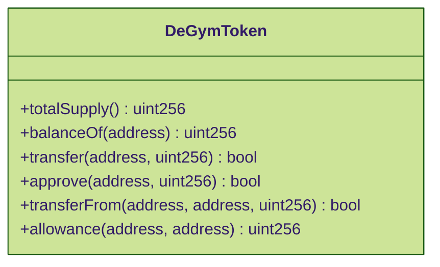
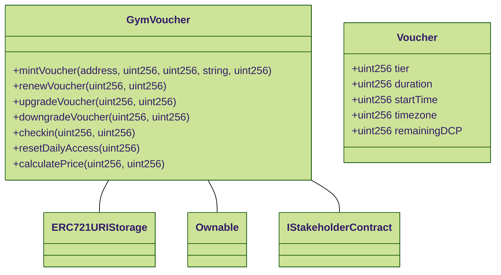
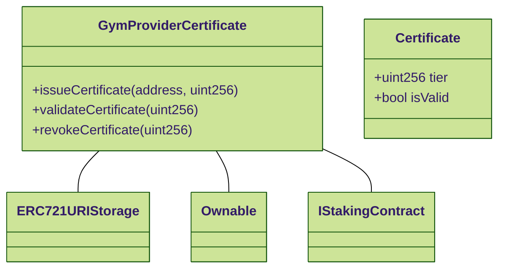
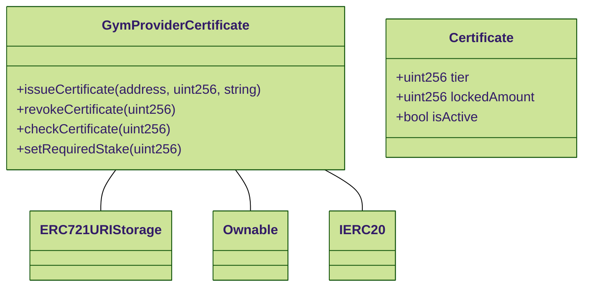
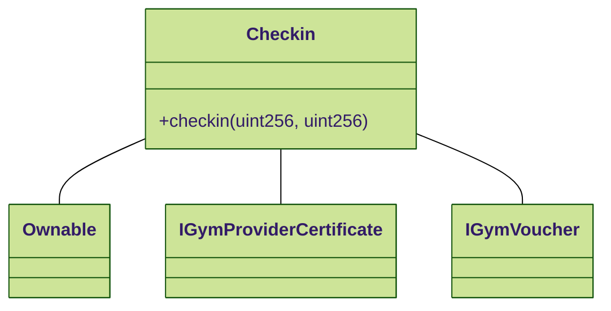
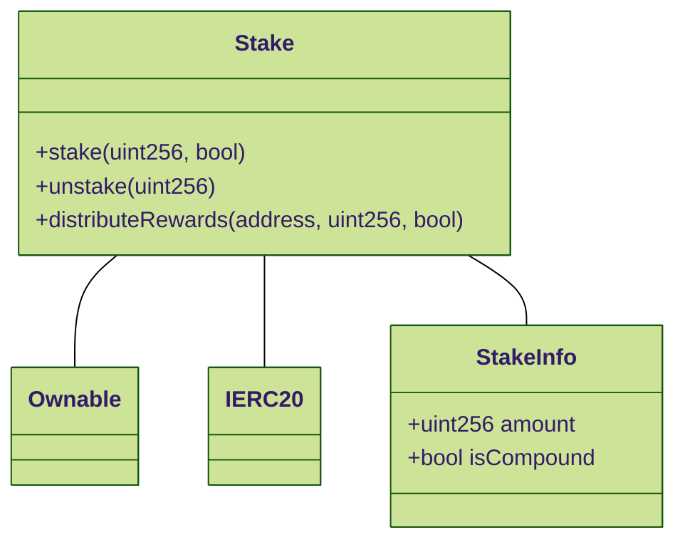

# Smart Contracts

## Overview

This documentation provides detailed information on the smart contracts used in the DeGym project. Each section includes a description of the contract's purpose, key functions, the Solidity code, and mermaid.js diagrams to illustrate contract interactions.

## Contracts
### ERC20 Token Contract

**Purpose**

The Token Contract manages the creation and distribution of the project's native token, $DGYM.

**Key Functions**

* *totalSupply():* Returns the total supply of the token.
* *balanceOf(address):* Returns the token balance of a specific address.
* *transfer(address, uint256):* Transfers tokens from the caller to a specified address.
* *approve(address, uint256):* Allows another address to spend a specified amount of tokens on behalf of the caller.
* *transferFrom(address, address, uint256):* Transfers tokens from one address to another using the allowance mechanism.
* *allowance(address, address):* Returns the remaining number of tokens that a spender is allowed to spend on behalf of the owner.

```solidity
// SPDX-License-Identifier: MIT
pragma solidity ^0.8.0;

import "@openzeppelin/contracts/token/ERC20/ERC20.sol";

contract DeGymToken is ERC20 {
    constructor(uint256 initialSupply) ERC20("DeGym Token", "DGYM") {
        _mint(msg.sender, initialSupply * 10 ** decimals());
    }
}
```

&#x20;



---

## Voucher NFT Contract

**Purpose**

The Voucher NFT Contract manages the issuance, renewal, upgrade, downgrade, and access control of gym access vouchers. Each voucher is an NFT representing a user's membership with specified tier and duration, and is capable of resetting daily access limits and accumulating daily check-in points (DCP).

**Key Functions**

* *mintVoucher(address, uint256, uint256, string, uint256):* Mints a new voucher for a user.
* *renewVoucher(uint256, uint256):* Renews the voucher's duration.
* *upgradeVoucher(uint256, uint256):* Upgrades the voucher's tier.
* *downgradeVoucher(uint256, uint256):* Downgrades the voucher's tier.
* *checkin(uint256, uint256):* Handles check-ins and resets DCP.


```solidity
// SPDX-License-Identifier: MIT
pragma solidity ^0.8.0;

import "@openzeppelin/contracts/token/ERC721/extensions/ERC721URIStorage.sol";
import "@openzeppelin/contracts/access/Ownable.sol";

interface IStakeholderContract {
    function distributeRewards(address recipient, uint256 amount, bool isCompound) external;
}

contract GymVoucher is ERC721URIStorage, Ownable {
    struct Voucher {
        uint256 tier;
        uint256 duration;
        uint256 startTime;
        uint256 timezone;
        uint256 remainingDCP;
    }

    uint256 public constant BASE_PRICE = 10;
    uint256 public constant MIN_PRICE_FACTOR = 70;
    uint256 public constant DECAY_RATE = 10;

    mapping(uint256 => Voucher) public vouchers;
    IStakeholderContract public stakeholderContract;
    uint256 public nextTokenId;

    event VoucherMinted(uint256 tokenId, address owner, uint256 tier, uint256 duration);
    event VoucherRenewed(uint256 tokenId, uint256 newDuration);
    event VoucherUpgraded(uint256 tokenId, uint256 newTier);
    event VoucherDowngraded(uint256 tokenId, uint256 newTier);
    event CheckIn(uint256 tokenId, uint256 DCPUsed);

    constructor(address stakeholderContractAddress) ERC721("Gym Voucher", "GYMV") {
        stakeholderContract = IStakeholderContract(stakeholderContractAddress);
    }

    function mintVoucher(address to, uint256 tier, uint256 duration, string memory tokenURI, uint256 timezone) public onlyOwner {
        uint256 tokenId = nextTokenId;
        _mint(to, tokenId);
        _setTokenURI(tokenId, tokenURI);
        vouchers[tokenId] = Voucher(tier, duration, block.timestamp, timezone, 2**tier);
        nextTokenId++;
        emit VoucherMinted(tokenId, to, tier, duration);
    }

    function renewVoucher(uint256 tokenId, uint256 duration) public {
        require(_isApprovedOrOwner(_msgSender(), tokenId), "Not approved or owner");
        vouchers[tokenId].duration += duration;
        emit VoucherRenewed(tokenId, duration);
    }

    function upgradeVoucher(uint256 tokenId, uint256 newTier) public {
        require(_isApprovedOrOwner(_msgSender(), tokenId), "Not approved or owner");
        require(newTier > vouchers[tokenId].tier, "New tier must be higher");
        vouchers[tokenId].tier = newTier;
        emit VoucherUpgraded(tokenId, newTier);
    }

    function downgradeVoucher(uint256 tokenId, uint256 newTier) public {
        require(_isApprovedOrOwner(_msgSender(), tokenId), "Not approved or owner");
        require(newTier < vouchers[tokenId].tier, "New tier must be lower");
        vouchers[tokenId].tier = newTier;
        emit VoucherDowngraded(tokenId, newTier);
    }

    function checkin(uint256 tokenId, uint256 gymTier) public {
        require(_isApprovedOrOwner(_msgSender(), tokenId), "Not approved or owner");
        require(gymTier <= vouchers[tokenId].tier, "Gym tier exceeds voucher tier");
        require(vouchers[tokenId].remainingDCP >= 2**gymTier, "Insufficient DCP");

        vouchers[tokenId].remainingDCP -= 2**gymTier;
        stakeholderContract.distributeRewards(ownerOf(tokenId), 2**gymTier * BASE_PRICE, false);
        emit CheckIn(tokenId, 2**gymTier);
    }

    function resetDailyAccess(uint256 tokenId) public {
        require(_isApprovedOrOwner(_msgSender(), tokenId), "Not approved or owner");
        vouchers[tokenId].remainingDCP = 2**vouchers[tokenId].tier;
    }

    function calculatePrice(uint256 tier, uint256 duration) public pure returns (uint256) {
        uint256 minBasePrice = MIN_PRICE_FACTOR * BASE_PRICE / 100;
        uint256 basePrice = BASE_PRICE * (1 - DECAY_RATE * (duration / 30 - 1) / 100);
        basePrice = basePrice > minBasePrice ? basePrice : minBasePrice;
        return basePrice * tier * duration / 30;
    }
}
```

&#x20;



---

## Gym Provider Certificate Contract

**Purpose**

The Gym Provider Certificate Contract manages the issuance and validation of certificates for gym providers. These certificates determine the tier eligibility for gym check-ins and ensure that gym providers maintain a minimum stake of DGYM tokens.

**Key Functions**

* *issueCertificate(address, uint256):* Issues a new certificate to a gym provider with a specified tier.
* *validateCertificate(uint256):* Validates if the certificate meets the tier requirements and the gym provider has the necessary DGYM tokens staked.
* *revokeCertificate(uint256):* Revokes a certificate if the gym provider fails to maintain the required stake.


```solidity
// SPDX-License-Identifier: MIT
pragma solidity ^0.8.0;

import "@openzeppelin/contracts/token/ERC721/extensions/ERC721URIStorage.sol";
import "@openzeppelin/contracts/access/Ownable.sol";

interface IStakingContract {
    function getStake(address user) external view returns (uint256);
}

contract GymProviderCertificate is ERC721URIStorage, Ownable {
    struct Certificate {
        uint256 tier;
        bool isValid;
    }

    mapping(uint256 => Certificate) public certificates;
    IStakingContract public stakingContract;
    uint256 public minimumStake;
    uint256 public nextTokenId;

    constructor(address stakingContractAddress, uint256 minStake) ERC721("Gym Provider Certificate", "GYMPC") {
        stakingContract = IStakingContract(stakingContractAddress);
        minimumStake = minStake;
    }

    function issueCertificate(address to, uint256 tier) public onlyOwner {
        require(stakingContract.getStake(to) >= minimumStake, "Insufficient stake to issue certificate");
        uint256 tokenId = nextTokenId;
        _mint(to, tokenId);
        _setTokenURI(tokenId, "ipfs://Qm..."); // Example IPFS URI
        certificates[tokenId] = Certificate(tier, true);
        nextTokenId++;
    }

    function validateCertificate(uint256 tokenId) public view returns (bool) {
        require(_exists(tokenId), "Certificate does not exist");
        return certificates[tokenId].isValid && stakingContract.getStake(ownerOf(tokenId)) >= minimumStake;
    }

    function revokeCertificate(uint256 tokenId) public onlyOwner {
        require(_exists(tokenId), "Certificate does not exist");
        certificates[tokenId].isValid = false;
    }
}
```



---

## GymProviderCertificate Contract

**Purpose**

The GymProviderCertificate contract issues certificates to gym providers who lock a specified amount of $DGYM tokens. These certificates determine the tier of check-ins a gym can provide. The tier ranges from 1 to 99, indicating the quality and access level of the gym.

**Key Functions**

* *issueCertificate(address, uint256):* Issues a certificate to a gym provider.
* *revokeCertificate(uint256):* Revokes a certificate.
* *checkCertificate(uint256):* Checks the validity and tier of a gym's certificate.

```solidity
// SPDX-License-Identifier: MIT
pragma solidity ^0.8.0;

import "@openzeppelin/contracts/token/ERC721/extensions/ERC721URIStorage.sol";
import "@openzeppelin/contracts/access/Ownable.sol";
import "@openzeppelin/contracts/token/ERC20/IERC20.sol";

contract GymProviderCertificate is ERC721URIStorage, Ownable {
    struct Certificate {
        uint256 tier;
        uint256 lockedAmount;
        bool isActive;
    }

    IERC20 public token;
    uint256 public nextCertificateId;
    uint256 public requiredStake;

    mapping(uint256 => Certificate) public certificates;
    mapping(address => uint256) public providerCertificate;

    event CertificateIssued(uint256 certificateId, address provider, uint256 tier);
    event CertificateRevoked(uint256 certificateId);

    constructor(address tokenAddress, uint256 _requiredStake) ERC721("Gym Provider Certificate", "GPC") {
        token = IERC20(tokenAddress);
        requiredStake = _requiredStake;
    }

    function issueCertificate(address provider, uint256 tier, string memory tokenURI) public onlyOwner {
        require(tier >= 1 && tier <= 99, "Tier must be between 1 and 99");
        require(token.balanceOf(provider) >= requiredStake, "Insufficient $DGYM balance");
        require(providerCertificate[provider] == 0, "Provider already has a certificate");

        uint256 certificateId = nextCertificateId;
        _mint(provider, certificateId);
        _setTokenURI(certificateId, tokenURI);

        certificates[certificateId] = Certificate(tier, requiredStake, true);
        providerCertificate[provider] = certificateId;
        nextCertificateId++;

        emit CertificateIssued(certificateId, provider, tier);
    }

    function revokeCertificate(uint256 certificateId) public onlyOwner {
        address provider = ownerOf(certificateId);
        certificates[certificateId].isActive = false;
        providerCertificate[provider] = 0;

        _burn(certificateId);
        emit CertificateRevoked(certificateId);
    }

    function checkCertificate(uint256 certificateId) public view returns (uint256 tier, uint256 lockedAmount, bool isActive) {
        Certificate storage certificate = certificates[certificateId];
        return (certificate.tier, certificate.lockedAmount, certificate.isActive);
    }

    function setRequiredStake(uint256 _requiredStake) public onlyOwner {
        requiredStake = _requiredStake;
    }
}
```





## Checkin Contract

**Purpose**

The Checkin contract validates and records check-ins at gym facilities. It ensures that the gym's certificate and the user's voucher are valid and deducts the appropriate number of DCP from the voucher.

**Key Functions**

* *checkin(uint256, uint256):* Validates and records a check-in.

```solidity
// SPDX-License-Identifier: MIT
pragma solidity ^0.8.0;

import "@openzeppelin/contracts/access/Ownable.sol";

interface IGymProviderCertificate {
    function checkCertificate(uint256 certificateId) external view returns (uint256, uint256, bool);
}

interface IGymVoucher {
    function checkin(uint256 tokenId, uint256 gymTier) external;
}

contract Checkin is Ownable {
    IGymProviderCertificate public providerCertificate;
    IGymVoucher public gymVoucher;

    event CheckinSuccessful(uint256 voucherId, uint256 certificateId, uint256 tier);

    constructor(address providerCertificateAddress, address gymVoucherAddress) {
        providerCertificate = IGymProviderCertificate(providerCertificateAddress);
        gymVoucher = IGymVoucher(gymVoucherAddress);
    }

    function checkin(uint256 voucherId, uint256 certificateId) public {
        (uint256 gymTier, , bool isActive) = providerCertificate.checkCertificate(certificateId);
        require(isActive, "Gym certificate is not active");

        gymVoucher.checkin(voucherId, gymTier);
        emit CheckinSuccessful(voucherId, certificateId, gymTier);
    }
}
```




---

# Stake Contract

**Purpose**

The Stake contract allows users to stake $DGYM tokens and choose between receiving compounded rewards in $DGYM or non-compounded rewards in USDT.

**Key Functions**

* *stake(uint256, bool):* Stakes $DGYM tokens.
* *unstake(uint256):* Unstakes $DGYM tokens.
* *distributeRewards(address, uint256, bool):* Distributes rewards to stakeholders.

```solidity
// SPDX-License-Identifier: MIT
pragma solidity ^0.8.0;

import "@openzeppelin/contracts/token/ERC20/IERC20.sol";
import "@openzeppelin/contracts/access/Ownable.sol";

contract Stake is Ownable {
    IERC20 public dGymToken;
    IERC20 public usdtToken;

    struct StakeInfo {
        uint256 amount;
        bool isCompound;
    }

    mapping(address => StakeInfo) public stakes;
    uint256 public totalStaked;

    event Staked(address indexed user, uint256 amount, bool isCompound);
    event Unstaked(address indexed user, uint256 amount);
    event RewardDistributed(address indexed user, uint256 amount, bool isCompound);

    constructor(address _dGymToken, address _usdtToken) {
        dGymToken = IERC20(_dGymToken);
        usdtToken = IERC20(_usdtToken);
    }

    function stake(uint256 amount, bool isCompound) public {
        require(amount > 0, "Amount must be greater than 0");
        dGymToken.transferFrom(msg.sender, address(this), amount);

        stakes[msg.sender] = StakeInfo(amount, isCompound);
        totalStaked += amount;

        emit Staked(msg.sender, amount, isCompound);
    }

    function unstake(uint256 amount) public {
        require(stakes[msg.sender].amount >= amount, "Insufficient stake");
        stakes[msg.sender].amount -= amount;
        totalStaked -= amount;

        dGymToken.transfer(msg.sender, amount);
        emit Unstaked(msg.sender, amount);
    }

    function distributeRewards(address recipient, uint256 amount, bool isCompound) external onlyOwner {
        if (isCompound) {
            dGymToken.transfer(recipient, amount);
        } else {
            usdtToken.transfer(recipient, amount);
        }

        emit RewardDistributed(recipient, amount, isCompound);
    }
}
```





# Final Notes

* **Voucher NFT Contract** handles the creation and management of gym membership vouchers, including pricing, check-ins, and reward distribution.
* **GymProviderCertificate Contract** ensures gym providers have the necessary certificates to offer gym services based on their tier and staked $DGYM tokens.
* **Checkin Contract** validates and records gym check-ins, ensuring that both the voucher and gym certificate are valid.
* **Stake Contract** manages the staking of $DGYM tokens, offering rewards in either compounded $DGYM or USDT.

These contracts collectively ensure a decentralized, transparent, and user-centric gym access ecosystem, aligned with the mission and vision of DeGym DAO.
