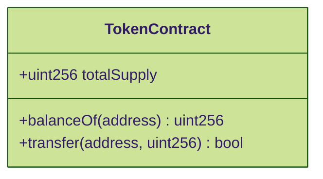
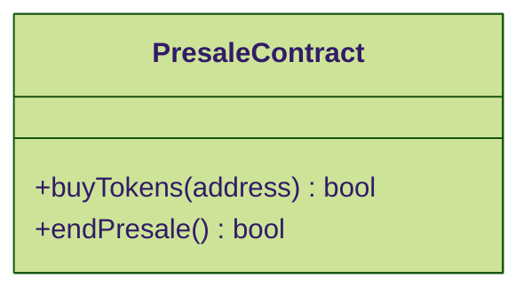
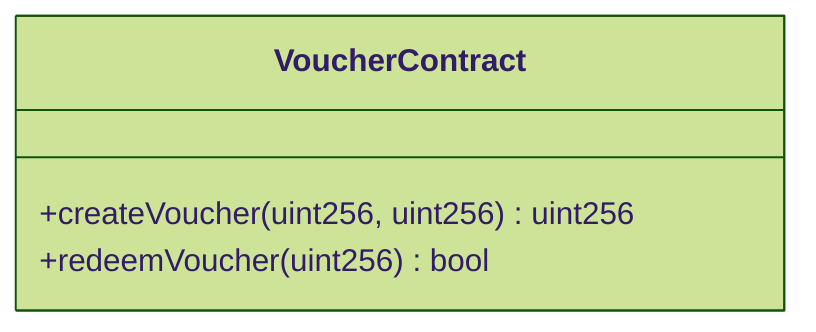
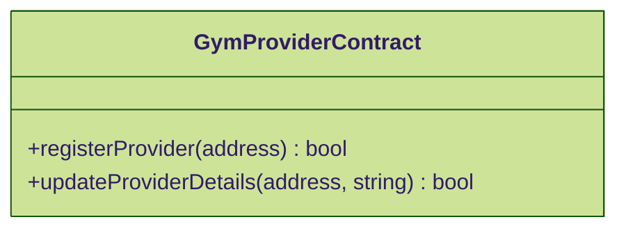

# Smart Contracts

## Overview

This documentation provides detailed information on the smart contracts used in the DeGym project. Each section includes a description of the contract's purpose, key functions, the Solidity code, and mermaid.js diagrams to illustrate contract interactions.

## Contracts
### Token Contract

**Purpose**

The Token Contract manages the creation and distribution of the project's native token, $DGYM.

**Key Functions**

* totalSupply(): Returns the total supply of the token.
* balanceOf(address): Returns the token balance of a specific address.
* transfer(address, uint256): Transfers tokens from the caller to a specified address.

```solidity
// SPDX-License-Identifier: MIT
pragma solidity ^0.8.0;

contract Token {
    string public name = "DeGym Token";
    string public symbol = "DGYM";
    uint8 public decimals = 18;
    uint256 public totalSupply;
    mapping(address => uint256) public balanceOf;

    event Transfer(address indexed from, address indexed to, uint256 value);

    constructor(uint256 initialSupply) {
        totalSupply = initialSupply * 10 ** uint256(decimals);
        balanceOf[msg.sender] = totalSupply;
    }

    function transfer(address _to, uint256 _value) public returns (bool success) {
        require(balanceOf[msg.sender] >= _value, "Insufficient balance");
        balanceOf[msg.sender] -= _value;
        balanceOf[_to] += _value;
        emit Transfer(msg.sender, _to, _value);
        return true;
    }
}
```

&#x20;



---
## Presale Contract

**Purpose**

The Presale Contract handles the initial distribution of $DGYM tokens before they are available on the open market.

**Key Functions**

* buyTokens(address): Allows users to purchase tokens during the presale.
* endPresale(): Ends the presale and finalizes token distribution.


```solidity
// SPDX-License-Identifier: MIT
pragma solidity ^0.8.0;

import "./Token.sol";

contract Presale {
    Token public token;
    address public admin;
    uint256 public tokenPrice;
    uint256 public tokensSold;

    event Sell(address indexed buyer, uint256 amount);

    constructor(Token _token, uint256 _tokenPrice) {
        admin = msg.sender;
        token = _token;
        tokenPrice = _tokenPrice;
    }

    function buyTokens(uint256 _numberOfTokens) public payable {
        require(msg.value == _numberOfTokens * tokenPrice, "Incorrect value sent");
        require(token.balanceOf(address(this)) >= _numberOfTokens, "Not enough tokens");
        tokensSold += _numberOfTokens;
        require(token.transfer(msg.sender, _numberOfTokens), "Token transfer failed");
        emit Sell(msg.sender, _numberOfTokens);
    }

    function endPresale() public {
        require(msg.sender == admin, "Only admin can end presale");
        require(token.transfer(admin, token.balanceOf(address(this))), "Token transfer failed");
    }
}
```

&#x20;



---

## Voucher Contract

**Purpose**

The Voucher Contract manages the creation and redemption of NFT vouchers that grant access to gym services.

**Key Functions**

* createVoucher(uint256, uint256): Creates a new voucher with specified tier and duration.
* redeemVoucher(uint256): Redeems a voucher for gym access.


```solidity
// SPDX-License-Identifier: MIT
pragma solidity ^0.8.0;

contract Voucher {
    struct VoucherDetails {
        uint256 tier;
        uint256 duration;
        bool isRedeemed;
    }

    mapping(uint256 => VoucherDetails) public vouchers;
    uint256 public nextVoucherId;

    event VoucherCreated(uint256 indexed voucherId, uint256 tier, uint256 duration);
    event VoucherRedeemed(uint256 indexed voucherId);

    function createVoucher(uint256 _tier, uint256 _duration) public returns (uint256) {
        vouchers[nextVoucherId] = VoucherDetails(_tier, _duration, false);
        emit VoucherCreated(nextVoucherId, _tier, _duration);
        nextVoucherId++;
        return nextVoucherId - 1;
    }

    function redeemVoucher(uint256 _voucherId) public {
        require(!vouchers[_voucherId].isRedeemed, "Voucher already redeemed");
        vouchers[_voucherId].isRedeemed = true;
        emit VoucherRedeemed(_voucherId);
    }
}

```



---

## Gym Provider Contract

**Purpose**

The Gym Provider Contract allows gym providers to register and offer their facilities to the network.

**Key Functions**

* registerProvider(address): Registers a new gym provider.
* updateProviderDetails(address, string): Updates the details of a gym provider.

```solidity
// SPDX-License-Identifier: MIT
pragma solidity ^0.8.0;

contract GymProvider {
    struct Provider {
        string details;
        bool isRegistered;
    }

    mapping(address => Provider) public providers;

    event ProviderRegistered(address indexed provider, string details);
    event ProviderUpdated(address indexed provider, string details);

    function registerProvider(address _provider, string memory _details) public {
        require(!providers[_provider].isRegistered, "Provider already registered");
        providers[_provider] = Provider(_details, true);
        emit ProviderRegistered(_provider, _details);
    }

    function updateProviderDetails(address _provider, string memory _details) public {
        require(providers[_provider].isRegistered, "Provider not registered");
        providers[_provider].details = _details;
        emit ProviderUpdated(_provider, _details);
    }
}

```


