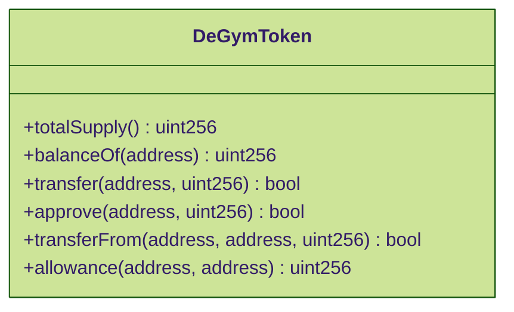
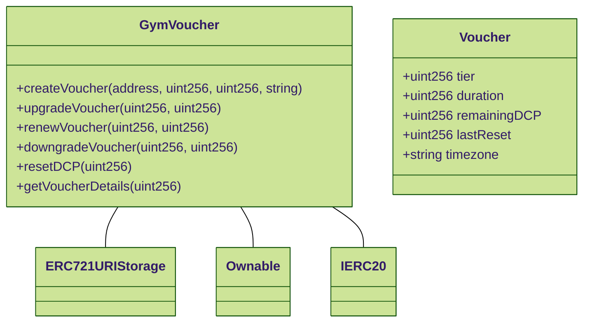
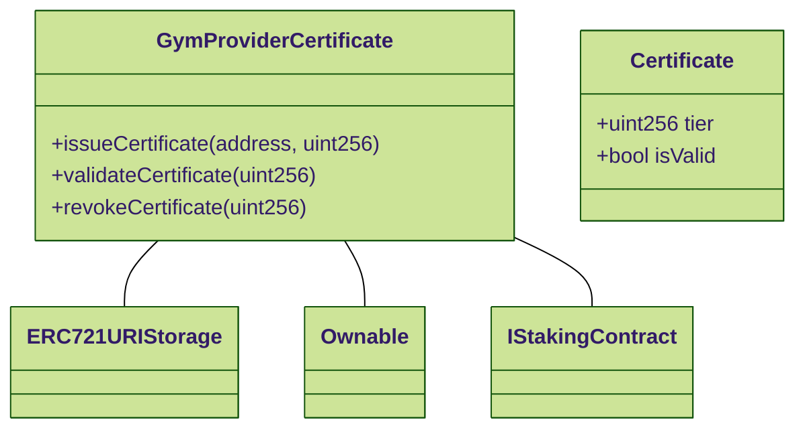
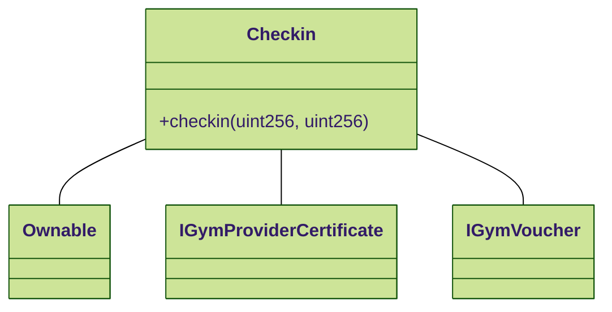
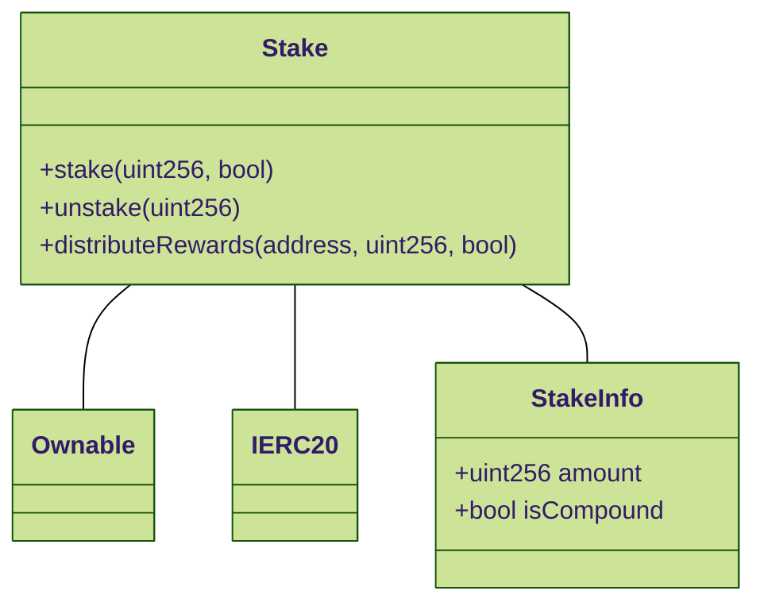

# 📝 Smart Contracts

## Smart Contracts

### Overview

This documentation provides detailed information on the smart contracts used in the DeGym project. Each section includes a description of the contract's purpose, key functions, the Solidity code, and mermaid.js diagrams to illustrate contract interactions.

### Contracts

#### ERC20 Token Contract

**Purpose**

The Token Contract manages the creation and distribution of the project's native token, $DGYM.

**Key Functions**

* _totalSupply():_ Returns the total supply of the token.
* _balanceOf(address):_ Returns the token balance of a specific address.
* _transfer(address, uint256):_ Transfers tokens from the caller to a specified address.
* _approve(address, uint256):_ Allows another address to spend a specified amount of tokens on behalf of the caller.
* _transferFrom(address, address, uint256):_ Transfers tokens from one address to another using the allowance mechanism.
* _allowance(address, address):_ Returns the remaining number of tokens that a spender is allowed to spend on behalf of the owner.

```solidity
// SPDX-License-Identifier: MIT
pragma solidity ^0.8.0;

import "@openzeppelin/contracts/token/ERC20/ERC20.sol";

contract DeGymToken is ERC20 {
    constructor(uint256 initialSupply) ERC20("DeGym Token", "DGYM") {
        _mint(msg.sender, initialSupply * 10 ** decimals());
    }
}
```



***

### Voucher NFT Contract

**Purpose**

The GymVoucher NFT contract handles the creation, management, and functionality of gym membership vouchers. This includes upgrading, renewing, and downgrading vouchers, each with specific rules and charges.

**Key Functions**

* _upgradeVoucher(uint256, uint256):_ Upgrades the voucher to a higher tier and charges for the remaining DCP.
* _renewVoucher(uint256, uint256):_ Renews the voucher for additional days and charges for the remaining DCP.
* _downgradeVoucher(uint256, uint256):_ Downgrades the voucher to a lower tier, redistributing the remaining DCP over a longer duration.

```solidity
// SPDX-License-Identifier: MIT
pragma solidity ^0.8.0;

import "@openzeppelin/contracts/token/ERC721/extensions/ERC721URIStorage.sol";
import "@openzeppelin/contracts/access/Ownable.sol";
import "@openzeppelin/contracts/token/ERC20/IERC20.sol";

contract GymVoucher is ERC721URIStorage, Ownable {
    struct Voucher {
        uint256 tier;
        uint256 duration; // in days
        uint256 remainingDCP;
        uint256 lastReset;
        string timezone;
    }

    IERC20 public token;
    uint256 public nextVoucherId;
    uint256 public basePrice = 10 ether;

    mapping(uint256 => Voucher) public vouchers;

    event VoucherUpgraded(uint256 voucherId, uint256 newTier);
    event VoucherRenewed(uint256 voucherId, uint256 additionalDays);
    event VoucherDowngraded(uint256 voucherId, uint256 newTier);

    constructor(address tokenAddress) ERC721("Gym Voucher", "GV") {
        token = IERC20(tokenAddress);
    }

    function createVoucher(address owner, uint256 tier, uint256 duration, string memory timezone) public onlyOwner {
        uint256 voucherId = nextVoucherId++;
        _mint(owner, voucherId);

        vouchers[voucherId] = Voucher({
            tier: tier,
            duration: duration,
            remainingDCP: 2 ** tier,
            lastReset: block.timestamp,
            timezone: timezone
        });

        _setTokenURI(voucherId, "");
    }

    function upgradeVoucher(uint256 voucherId, uint256 newTier) public payable {
        require(_isApprovedOrOwner(_msgSender(), voucherId), "Caller is not owner nor approved");
        require(newTier > vouchers[voucherId].tier, "New tier must be higher");

        Voucher storage voucher = vouchers[voucherId];
        uint256 currentTier = voucher.tier;
        uint256 remainingDCP = voucher.remainingDCP;

        // Calculate price based on remaining DCP and new tier
        uint256 price = (remainingDCP * (2 ** (newTier - currentTier))) / (2 ** currentTier) * basePrice / (2 ** 30);
        require(msg.value >= price, "Insufficient funds for upgrade");

        voucher.tier = newTier;
        voucher.remainingDCP = remainingDCP * (2 ** (newTier - currentTier));

        emit VoucherUpgraded(voucherId, newTier);
    }

    function renewVoucher(uint256 voucherId, uint256 additionalDays) public payable {
        require(_isApprovedOrOwner(_msgSender(), voucherId), "Caller is not owner nor approved");

        Voucher storage voucher = vouchers[voucherId];
        // Calculate price based on remaining DCP and additional days
        uint256 price = (voucher.remainingDCP * additionalDays * basePrice) / (voucher.duration * (2 ** 30));
        require(msg.value >= price, "Insufficient funds for renewal");

        voucher.duration += additionalDays;

        emit VoucherRenewed(voucherId, additionalDays);
    }

    function downgradeVoucher(uint256 voucherId, uint256 newTier) public {
        require(_isApprovedOrOwner(_msgSender(), voucherId), "Caller is not owner nor approved");
        require(newTier < vouchers[voucherId].tier, "New tier must be lower");

        Voucher storage voucher = vouchers[voucherId];
        uint256 remainingDCP = voucher.remainingDCP;

        // Downgrade to a lower tier and redistribute remaining DCP over a longer duration
        voucher.duration += (remainingDCP / (2 ** (voucher.tier - newTier)));
        voucher.tier = newTier;
        voucher.remainingDCP = remainingDCP / (2 ** (voucher.tier - newTier));

        emit VoucherDowngraded(voucherId, newTier);
    }

    function resetDCP(uint256 voucherId) public onlyOwner {
        Voucher storage voucher = vouchers[voucherId];
        voucher.remainingDCP = 2 ** voucher.tier;
        voucher.lastReset = block.timestamp;
    }

    function getVoucherDetails(uint256 voucherId) public view returns (Voucher memory) {
        return vouchers[voucherId];
    }
}
```



***

### Gym Provider Certificate Contract

**Purpose**

The Gym Provider Certificate Contract manages the issuance and validation of certificates for gym providers. These certificates determine the tier eligibility for gym check-ins and ensure that gym providers maintain a minimum stake of DGYM tokens.

**Key Functions**

* _issueCertificate(address, uint256):_ Issues a new certificate to a gym provider with a specified tier.
* _validateCertificate(uint256):_ Validates if the certificate meets the tier requirements and the gym provider has the necessary DGYM tokens staked.
* _revokeCertificate(uint256):_ Revokes a certificate if the gym provider fails to maintain the required stake.

```solidity
// SPDX-License-Identifier: MIT
pragma solidity ^0.8.0;

import "@openzeppelin/contracts/token/ERC721/extensions/ERC721URIStorage.sol";
import "@openzeppelin/contracts/access/Ownable.sol";

interface IStakingContract {
    function getStake(address user) external view returns (uint256);
}

contract GymProviderCertificate is ERC721URIStorage, Ownable {
    struct Certificate {
        uint256 tier;
        bool isValid;
    }

    mapping(uint256 => Certificate) public certificates;
    IStakingContract public stakingContract;
    uint256 public minimumStake;
    uint256 public nextTokenId;

    constructor(address stakingContractAddress, uint256 minStake) ERC721("Gym Provider Certificate", "GYMPC") {
        stakingContract = IStakingContract(stakingContractAddress);
        minimumStake = minStake;
    }

    function issueCertificate(address to, uint256 tier) public onlyOwner {
        require(stakingContract.getStake(to) >= minimumStake, "Insufficient stake to issue certificate");
        uint256 tokenId = nextTokenId;
        _mint(to, tokenId);
        _setTokenURI(tokenId, "ipfs://Qm..."); // Example IPFS URI
        certificates[tokenId] = Certificate(tier, true);
        nextTokenId++;
    }

    function validateCertificate(uint256 tokenId) public view returns (bool) {
        require(_exists(tokenId), "Certificate does not exist");
        return certificates[tokenId].isValid && stakingContract.getStake(ownerOf(tokenId)) >= minimumStake;
    }

    function revokeCertificate(uint256 tokenId) public onlyOwner {
        require(_exists(tokenId), "Certificate does not exist");
        certificates[tokenId].isValid = false;
    }
}
```



***

### Checkin Contract

**Purpose**

The Checkin contract validates and records check-ins at gym facilities. It ensures that the gym's certificate and the user's voucher are valid and deducts the appropriate number of DCP from the voucher.

**Key Functions**

* _checkin(uint256, uint256):_ Validates and records a check-in.

```solidity
// SPDX-License-Identifier: MIT
pragma solidity ^0.8.0;

import "@openzeppelin/contracts/access/Ownable.sol";

interface IGymProviderCertificate {
    function checkCertificate(uint256 certificateId) external view returns (uint256, uint256, bool);
}

interface IGymVoucher {
    function checkin(uint256 tokenId, uint256 gymTier) external;
}

contract Checkin is Ownable {
    IGymProviderCertificate public providerCertificate;
    IGymVoucher public gymVoucher;

    event CheckinSuccessful(uint256 voucherId, uint256 certificateId, uint256 tier);

    constructor(address providerCertificateAddress, address gymVoucherAddress) {
        providerCertificate = IGymProviderCertificate(providerCertificateAddress);
        gymVoucher = IGymVoucher(gymVoucherAddress);
    }

    function checkin(uint256 voucherId, uint256 certificateId) public {
        (uint256 gymTier, , bool isActive) = providerCertificate.checkCertificate(certificateId);
        require(isActive, "Gym certificate is not active");

        gymVoucher.checkin(voucherId, gymTier);
        emit CheckinSuccessful(voucherId, certificateId, gymTier);
    }
}
```



***

## Stake Contract

**Purpose**

The Stake contract allows users to stake $DGYM tokens and choose between receiving compounded rewards in $DGYM or non-compounded rewards in USDT.

**Key Functions**

* _stake(uint256, bool):_ Stakes $DGYM tokens.
* _unstake(uint256):_ Unstakes $DGYM tokens.
* _distributeRewards(address, uint256, bool):_ Distributes rewards to stakeholders.

```solidity
// SPDX-License-Identifier: MIT
pragma solidity ^0.8.0;

import "@openzeppelin/contracts/token/ERC20/IERC20.sol";
import "@openzeppelin/contracts/access/Ownable.sol";

contract Stake is Ownable {
    IERC20 public dGymToken;
    IERC20 public usdtToken;

    struct StakeInfo {
        uint256 amount;
        bool isCompound;
    }

    mapping(address => StakeInfo) public stakes;
    uint256 public totalStaked;

    event Staked(address indexed user, uint256 amount, bool isCompound);
    event Unstaked(address indexed user, uint256 amount);
    event RewardDistributed(address indexed user, uint256 amount, bool isCompound);

    constructor(address _dGymToken, address _usdtToken) {
        dGymToken = IERC20(_dGymToken);
        usdtToken = IERC20(_usdtToken);
    }

    function stake(uint256 amount, bool isCompound) public {
        require(amount > 0, "Amount must be greater than 0");
        dGymToken.transferFrom(msg.sender, address(this), amount);

        stakes[msg.sender] = StakeInfo(amount, isCompound);
        totalStaked += amount;

        emit Staked(msg.sender, amount, isCompound);
    }

    function unstake(uint256 amount) public {
        require(stakes[msg.sender].amount >= amount, "Insufficient stake");
        stakes[msg.sender].amount -= amount;
        totalStaked -= amount;

        dGymToken.transfer(msg.sender, amount);
        emit Unstaked(msg.sender, amount);
    }

    function distributeRewards(address recipient, uint256 amount, bool isCompound) external onlyOwner {
        if (isCompound) {
            dGymToken.transfer(recipient, amount);
        } else {
            usdtToken.transfer(recipient, amount);
        }

        emit RewardDistributed(recipient, amount, isCompound);
    }
}
```



## Final Notes

* **Voucher NFT Contract** handles the creation and management of gym membership vouchers, including pricing, check-ins, and reward distribution.
* **GymProviderCertificate Contract** ensures gym providers have the necessary certificates to offer gym services based on their tier and staked $DGYM tokens.
* **Checkin Contract** validates and records gym check-ins, ensuring that both the voucher and gym certificate are valid.
* **Stake Contract** manages the staking of $DGYM tokens, offering rewards in either compounded $DGYM or USDT.

These contracts collectively ensure a decentralized, transparent, and user-centric gym access ecosystem, aligned with the mission and vision of DeGym DAO.
